# 功能详解

本文档详细说明一键Patcher 的各项功能，包括使用场景、参数说明和代码示例。

> 基础概念请参阅 [README.md](./README.md)。

---

## 目录

- [架构概览](#架构概览)
- [导入控制](#导入控制)
  - [skip_import - 跳过不可用模块](#skip_import-跳过不可用模块)
  - [replace_import - 替换模块导入](#replace_import-替换模块导入)
  - [inject_import - 注入缺失导入](#inject_import-注入缺失导入)
- [补丁机制](#补丁机制)
  - [AtomicPatch - 原子补丁](#atomicpatch-原子补丁)
  - [Patch - 组合补丁](#patch-组合补丁)
  - [RegistryPatch - 注册表补丁](#registrypatch-注册表补丁)
  - [aliases - 处理模块重导出](#aliases-处理模块重导出)
  - [precheck - 应用前条件检查](#precheck-应用前条件检查)
  - [runtime_check - 运行时条件分发](#runtime_check-运行时条件分发)
  - [with_imports - 延迟导入装饰器](#with_imports-延迟导入装饰器)
  - [target_wrapper - 包装原函数](#target_wrapper-包装原函数)
  - [replacement_wrapper - 包装替换函数](#replacement_wrapper-包装替换函数)
- [辅助工具](#辅助工具)
  - [with_profiling - 性能采集](#with_profiling-性能采集)
  - [brake_at - 训练早停](#brake_at-训练早停)
  - [allow_internal_format - NPU 内部格式控制](#allow_internal_format-npu-内部格式控制)
  - [日志配置](#日志配置)
  - [补丁状态查看](#补丁状态查看)
- [实战示例](#实战示例)
- [进阶用法](#进阶用法)
  - [自定义Patcher（不使用default_patcher）](#自定义patcher不使用default_patcher)
  - [Legacy兼容（1.0 API）](#legacy兼容10-api)
- [为什么选择2.0写法？](#为什么选择20写法)
- [注意事项](#注意事项)

---

## 架构概览

### 分层架构

```mermaid
---
config:
  look: neo
  theme: base
  themeVariables:
    primaryColor: "#2d3436"
    primaryTextColor: "#dfe6e9"
    primaryBorderColor: "#6c5ce7"
    secondaryColor: "#353b48"
    tertiaryColor: "#2c3e50"
    lineColor: "#6c5ce7"
    fontFamily: "Segoe UI, Microsoft YaHei, sans-serif"
---
flowchart TB
    subgraph L1 ["👤 用户代码层"]
        U(["📝 配置补丁、导入控制、应用补丁"])
    end

    subgraph L2 ["🎛️ Patcher 管理层"]
        direction LR
        M1(["📥 导入控制<br/><small>skip / replace / inject</small>"])
        M2(["📋 补丁收集<br/><small>Patch 类 / AtomicPatch</small>"])
        M3(["🔧 辅助工具<br/><small>profiling / brake_at</small>"])
    end

    subgraph L3 ["📦 Patch 组织层"]
        direction LR
        P1(["🏗️ 预定义 Patch<br/><small>框架内置的补丁</small>"])
        P2(["✏️ 自定义 Patch<br/><small>用户自行编写</small>"])
    end

    subgraph L4 ["⚡ AtomicPatch 执行层"]
        AP(["🎯 target → replacement<br/><small>+ precheck / runtime_check / aliases</small>"])
    end

    subgraph L5 ["📚 目标模块层"]
        TM(["🧩 mmcv / torch / numpy / 第三方库"])
    end

    L1 --> L2
    L2 --> L3
    P1 & P2 -->|"patches&#40;&#41;"| L4
    L4 --> L5
```



---

## 导入控制

### 选型速览

三个导入控制 API 解决的是三类不同问题，建议先判断问题发生在哪一层：

| 你遇到的问题 | 该用什么 | 是否要求在目标 import 之前 |
|--------------|----------|----------------------------|
| CUDA 专属依赖在当前环境不存在，但后续逻辑不会真正执行它 | `skip_import()` | 是 |
| 原模块本身就该被另一个模块或导出表整体接管 | `replace_import()` | 是 |
| 父模块少导出了某个类/函数，导致 `from pkg import Name` 失败 | `inject_import()` | 最好是；它会立即执行，但若消费方已经提前导入失败，就仍然太晚 |

仓内真实案例：

- `skip_import()`：DiffusionDrive / PanoOcc 在入口里跳过 `flash_attn`、`torch_scatter`
- `replace_import()`：DiffusionDrive 将 `projects.mmdet3d_plugin.ops.deformable_aggregation` 的导出替换为 NPU 实现
- `inject_import()`：DiffusionDrive 将 `V1SparseDrive`、`V1SparseDriveHead` 等类补回 `projects.mmdet3d_plugin.models`

### skip_import - 跳过不可用模块

**使用场景**：运行开源模型时遇到 `ModuleNotFoundError`，报错的模块是 CUDA 生态专属的（如 `flash_attn`、`torch_scatter`），在昇腾环境中不存在也无需安装。这类 import 可能分散在模型代码的多个文件中，逐个找到并删除既麻烦又会修改原始代码。`skip_import` 可以在不改动任何源代码的情况下，拦截这些 import 请求并返回无害的 Stub 对象。

**行为**：被 skip 的模块及其所有子模块的 import 都会成功，但返回的是 Stub 对象——属性访问返回 Stub，函数调用返回 None。

```python
patcher.skip_import("flash_attn", "torch_scatter")

# 之后以下 import 都不会报错：
from flash_attn.flash_attn_interface import flash_attn_func  # → Stub
from flash_attn.any.deep.path import anything                # → Stub
import torch_scatter                                          # → Stub
```

真实案例：

```python
# DiffusionDrive / PanoOcc 入口中的常见写法
patcher.skip_import("flash_attn")
patcher.skip_import("torch_scatter")
```

适用前提：

- 这些模块只是“会被 import”，但后续真正运行时不会走到它们的原始实现。
- 如果下游逻辑真的依赖这个模块提供的计算能力，`skip_import()` 只会让 import 过掉，不会替你补功能；这时通常应该改用 `replace_import()`。

---

### replace_import - 替换模块导入

**使用场景**：某个 CUDA 算子模块需要替换为 NPU 实现。与 `skip_import` 不同，替换后的模块提供实际可用的功能实现。

推荐把第二个参数理解为“模块替身”，也就是“后者替换前者”。

默认推荐顺序是：

1. **整模块替换**：直接用最简写法 `replace_import("old.module", "new.module")`
2. **仅提供导出表**：用 `replace_with.module(...)`，但这是进阶用法
3. **以某模块为模板并覆写导出**：用 `replace_with.module(...)`，也属于进阶用法

```python
# 方式1：用另一个模块完全替换（最直观、默认推荐）
patcher.replace_import("cuda_ops.special_op", "mx_driving.npu_ops")

# 方式2：替换模块中的特定导出
# 当代码 from projects.ops.cuda_op import MyFunction 时，得到 NPUImpl
from mx_driving.patcher import replace_with

patcher.replace_import(
    "projects.ops.cuda_op",
    replace_with.module(
        MyFunction=NPUImpl,
        AnotherFunc=NPUAnotherImpl,
    ),
)

# 方式3：以另一个模块为模板，并覆盖特定导出
patcher.replace_import(
    "old.module",
    replace_with.module("new.module", SpecialFunc=custom_impl),
)
```

兼容写法：

```python
patcher.replace_import("projects.ops.cuda_op", MyFunction=NPUImpl)
patcher.replace_import("old.module", base_module="new.module", exports={"SpecialFunc": custom_impl})
```

当前行为与限制：

- `replace_import()` 现在会优先保留真实父包和 namespace package，不再用空 stub 污染父包；`import pkg.mod` 和 `from pkg import mod` 这类标准导入形式都属于支持路径。
- 如果目标模块已经出现在 `sys.modules` 中，`replace_import()` 会跳过并给出 warning。这是当前最重要的限制，也是最常见的不生效原因。
- 使用 `base_module` 或 `replace_with.module("new.module")` 时，替身模块是对源模块导出的快照拷贝，再叠加 `exports` 覆写；它不是对原模块的实时代理。

仓内真实案例：

```python
# DiffusionDrive: 让项目代码继续 import 原路径，
# 但真正拿到的是我们提供的 NPU 版 DeformableAggregationFunction
patcher.replace_import(
    "projects.mmdet3d_plugin.ops.deformable_aggregation",
    DeformableAggregationFunction=_DeformableAggregationFunction,  # 仓内现有兼容写法
)
```

说明：

- 仓内现有模型迁移代码里还能看到这种直接传 `**kwargs` 的兼容写法。
- 如果你在写新代码，推荐改成 `replace_with.module(DeformableAggregationFunction=...)`，因为它更容易一眼看出“后者是模块替身”。

这个案例适合 `replace_import()` 而不适合 `AtomicPatch()` 的原因是：

- 风险点发生在模块导入边界，而不是某个函数已经成功 import 之后
- 下游代码是 `from ... import DeformableAggregationFunction`
- 我们需要在 import 时就把模块导出表换掉

时序示例：

```python
# ✅ 正确：先 replace_import，再 import 目标模块
patcher.replace_import("pkg.cuda_op", "pkg.npu_op")
from pkg.cuda_op import run

# ❌ 太晚：目标模块已经进入 sys.modules
from pkg.cuda_op import run
patcher.replace_import("pkg.cuda_op", "pkg.npu_op")
```

#### 高级用法：只替换模块里的部分导出

这类写法指的是：

```python
from mx_driving.patcher import replace_with

patcher.replace_import(
    "pkg.cuda_op",
    replace_with.module(MyKernel=MyNpuKernel),
)
```

它不是“把 `pkg.cuda_op.MyKernel` 这个属性 patch 掉”，而是：

1. 先构造一个新的替身模块 `pkg.cuda_op`
2. 再把 `MyKernel=MyNpuKernel` 这些导出挂到这个替身模块上
3. 后续代码再去 `import pkg.cuda_op` 或 `from pkg.cuda_op import MyKernel` 时，拿到的是这个替身模块里的导出

所以它适合的场景很窄，也更容易被误用。建议先问自己两个问题：

- 问题是不是发生在“模块导入边界”而不是某个函数已经成功 import 之后？
- 下游代码是不是通过 `from pkg.cuda_op import MyKernel` 这种方式消费模块导出的？

只有这两个答案都偏向“是”，这种写法才通常合适。

一个更具体的心智模型：

```python
# 用户代码
from pkg.cuda_op import MyKernel

# replace_import 做的不是：
# pkg.cuda_op.MyKernel = MyNpuKernel
#
# 而更像是：
# fake_module = ModuleType("pkg.cuda_op")
# fake_module.MyKernel = MyNpuKernel
# sys.modules["pkg.cuda_op"] = fake_module
```

真实案例还是 DiffusionDrive 这条链：

```python
patcher.replace_import(
    "projects.mmdet3d_plugin.ops.deformable_aggregation",
    replace_with.module(
        DeformableAggregationFunction=_DeformableAggregationFunction,
    ),
)
```

为什么这里不用 `AtomicPatch()`：

- 原始风险点在 `projects.mmdet3d_plugin.ops.deformable_aggregation` 这个模块的导入和导出阶段
- 下游拿的是 `DeformableAggregationFunction` 这个导出名
- 我们需要在 import 时就把整个模块入口接管，而不是等模块先导入成功后再去改属性

这类写法的限制也要比整模块替换更值得强调：

- 它更依赖你对“目标模块对外到底导出了什么”有准确理解。
- 如果下游实际上 import 的不是你替换的那个导出名，而是模块里的别的符号，这种写法就不会生效。
- 如果你真正想做的是“模块已经能正常 import，只是其中某个函数/类需要换实现”，通常还是 `AtomicPatch()` 更直接，也更不容易误导读者。

结论：

- 把 `replace_import("old.module", "new.module")` 视为常规能力。
- 把 `replace_with.module(MyKernel=...)` 视为特殊能力，只在你明确需要“构造替身模块导出表”时使用。

---

### inject_import - 注入缺失导入

**使用场景**：开源模型自身遗漏了某些 import（例如 `__init__.py` 中未导出某个类），导致运行时 `ImportError`。这种情况虽然罕见，但一旦遇到，`inject_import` 可以在不修改模型代码的前提下修复问题。

```python
# 场景：a.b.c 中定义了 MyClass，但 a.b 的 __init__.py 忘记导出
# 导致 from a.b import MyClass 失败
patcher.inject_import("a.b.c", "MyClass", "a.b")
# 修复后：from a.b import MyClass 可用

# 场景：NPU 迁移需要在目标模块中补充额外的类
patcher.inject_import(
    "mx_driving.npu_ops",        # 源模块（类定义所在）
    "NPUSpecialOp",              # 要注入的名称
    "projects.ops",              # 目标模块（注入到此处）
)
```

真实案例：

```python
patcher.inject_import(
    "projects.mmdet3d_plugin.models.sparsedrive_v1",
    "V1SparseDrive",
    "projects.mmdet3d_plugin.models",
)
```

当前行为细节：

- `inject_import()` 在调用时立即执行，不需要等到 `apply()`。
- 如果目标模块已有同名属性，不会覆盖原值。
- 如果目标模块定义了 `__all__`，注入成功后会尽量把名称补进 `__all__`。

---

## 补丁机制

### AtomicPatch - 原子补丁

AtomicPatch 是最基础的补丁单元，执行单个 **target → replacement** 替换。

```python
# 最简形式：指定 target 路径和 replacement 函数
AtomicPatch("mmcv.ops.func", npu_func)

# 字符串形式的 replacement（延迟解析，避免循环导入）
AtomicPatch("module.func", "mx_driving.ops.npu_func")
```

**完整参数**：

```python
AtomicPatch(
    target="mmcv.ops.msda.forward",     # 被替换的原始属性路径
    replacement=npu_forward,             # 替换实现（与 target_wrapper 至少提供一个）
    aliases=["mmcv.ops.MSDA.forward"],   # 别名路径列表
    precheck=lambda: mmcv_version.is_v2x,  # 应用前检查
    runtime_check=check_dtype,           # 运行时条件分发
    target_wrapper=wrap_fn,              # 包装原函数
    replacement_wrapper=add_logging,     # 包装 replacement
)
```

---

### Patch - 组合补丁

Patch 将多个相关的 AtomicPatch 组织在一起。深度学习算子通常有 forward 和 backward 两个方法需要替换，组合补丁是最常用的组织形式。

```python
from mx_driving.patcher import Patch, AtomicPatch
from mx_driving.patcher.patch import with_imports

class MyOpPatch(Patch):
    @classmethod
    def patches(cls, options=None):
        return [
            AtomicPatch("module.Op.forward", cls._forward),
            AtomicPatch("module.Op.backward", cls._backward),
        ]

    @staticmethod
    @with_imports(("torch_npu", "npu_op"))
    def _forward(ctx, x):
        return npu_op(x)  # noqa: F821

    @staticmethod
    def _backward(ctx, grad):
        return grad
```

补充说明：

- `Patch.name` 现在是可选的；若不显式定义，默认使用类名，例如上面的补丁默认名就是 `MyOpPatch`。
- 需要稳定外部标识时，仍建议显式写 `name`，例如补丁会被用户配置禁用、会跨版本迁移，或需要和 `legacy_name` 对齐。
- `patcher.disable()` 接受三类参数：字符串名、`Patch` 类、补丁实例。2.0 推荐直接写 `patcher.disable(MyOpPatch)`。

---

### RegistryPatch - 注册表补丁

用于向 mmcv/mmengine 的 Registry 注册类：

```python
from mx_driving.patcher import RegistryPatch

RegistryPatch(
    "mmcv.runner.HOOKS",      # Registry 路径
    MyOptimizerHook,          # 要注册的类
    name="OptimizerHook",     # 注册名称
    force=True,               # 强制覆盖已有注册
)
```

---

### aliases - 处理模块重导出

**使用场景**：你为某个 **target**（被替换的原始函数/类）编写了 AtomicPatch，填写了该属性在源文件中的路径作为 target，但发现补丁没有生效。

这通常是因为开源模型通过以下方式导入了 target，导致 target 实际上存在于多个路径下：

1. **`from ... import ...`**：target 被直接导入到另一个模块的命名空间
2. **`import ... as ...`**：target 被重命名导入
3. **`__init__.py` 重导出**：target 通过包的 `__init__.py` 被提升到上层路径

如果模型代码使用的是这些 **别名路径** 而非 target 的原始定义路径，那么只替换原始路径是不够的。`aliases` 参数用于指定 **target 的所有别名路径**，确保所有访问路径都被替换。

```python
# 示例：mmcv.ops.__init__.py 中有
# from .multi_scale_deform_attn import MultiScaleDeformableAttnFunction
# 导致同一个类有两个访问路径

AtomicPatch(
    # target 的原始定义路径
    "mmcv.ops.multi_scale_deform_attn.MultiScaleDeformableAttnFunction.forward",
    npu_forward,
    aliases=[
        # target 通过 __init__.py 重导出后的别名路径
        "mmcv.ops.MultiScaleDeformableAttnFunction.forward",
    ],
)
```

---

### precheck - 应用前条件检查

precheck 在 `patcher.apply()` 时调用，返回 `False` 则跳过该补丁，不执行替换。常用于版本约束。

```mermaid
---
config:
  look: neo
  theme: base
  themeVariables:
    primaryColor: "#2d3436"
    primaryTextColor: "#dfe6e9"
    primaryBorderColor: "#6c5ce7"
    secondaryColor: "#353b48"
    tertiaryColor: "#2c3e50"
    lineColor: "#6c5ce7"
    fontFamily: "Segoe UI, Microsoft YaHei, sans-serif"
---
flowchart TD
    A(["🚀 patcher.apply&#40;&#41;"]) --> B(["🔍 对每个 AtomicPatch"])
    B --> C{"🔐 precheck&#40;&#41;"}
    C -->|"✅ 返回 True"| D(["⚡ 执行替换"])
    C -->|"❌ 返回 False"| E(["⏭️ 跳过"])
```



```python
from mx_driving.patcher import mmcv_version

AtomicPatch(
    "mmcv.ops.msda.forward",
    npu_forward,
    precheck=lambda: mmcv_version.is_v2x,  # 仅 mmcv 2.x 时应用
)
```

---

### runtime_check - 运行时条件分发

runtime_check 在每次被补丁替换后的函数被调用时执行检查，动态选择调用 **replacement 函数**（NPU 实现）还是**原始函数**。参数必须与 target 函数一致。

```mermaid
---
config:
  look: neo
  theme: base
  themeVariables:
    primaryColor: "#2d3436"
    primaryTextColor: "#dfe6e9"
    primaryBorderColor: "#6c5ce7"
    secondaryColor: "#353b48"
    tertiaryColor: "#2c3e50"
    lineColor: "#6c5ce7"
    fontFamily: "Segoe UI, Microsoft YaHei, sans-serif"
---
flowchart TD
    A(["📞 被替换的函数被调用"]) --> B{"🔍 runtime_check&#40;*args&#41;"}
    B -->|"✅ 返回 True"| C(["🚀 调用 replacement 函数<br/><small>NPU 实现</small>"])
    B -->|"❌ 返回 False"| D(["🔙 回退调用原始函数"])
```



```python
def check_fp32(input_tensor, weight, bias=None):
    """仅对 FP32 张量使用 NPU 优化"""
    return input_tensor.dtype == torch.float32

AtomicPatch(
    "module.conv",
    npu_conv,
    runtime_check=check_fp32,
)
```

---

### with_imports - 延迟导入装饰器

**使用场景**：编写 replacement 函数时，通常需要 import 一些 NPU 相关的模块（如 `torch_npu`）。直接在函数体内写 `import` 语句会导致以下问题：

- **循环导入**（Circular Import）：模块 A import 模块 B，模块 B 又 import 模块 A，导致 `ImportError`。如果 replacement 函数所在模块在导入时又去导入 target 模块，就可能触发循环导入。
- **延迟导入**（Lazy Import）：某些模块需要在特定时机才能导入（例如必须在 `apply()` 之后），直接在模块顶部 import 会失败。
- **代码风格不一致**：如果把 import 写在函数体内，replacement 函数与被替换的原始函数在代码风格上会有明显差异，降低可读性。

`with_imports` 通过装饰器声明依赖，在函数首次调用时才执行导入，注入到函数的全局命名空间中。这样 replacement 函数的写法可以与原始函数保持一致——import 不在函数体内，调用 API 时的写法也完全相同。

**语法格式**：

```python
from mx_driving.patcher.patch import with_imports

@with_imports(
    "module_name",                    # 导入整个模块: import module_name
    ("module", "attr"),               # 从模块导入: from module import attr
    ("module", "attr", "alias"),      # 带别名: from module import attr as alias
)
def my_function():
    pass
```

还支持两种增强用法：

```python
# 方式4：@表达式形式的延迟装饰器
@with_imports(
    ("mmcv.runner", "auto_fp16"),
    "@auto_fp16(apply_to=('q', 'k', 'v'), out_fp32=True)",
)
def forward(self, q, k, v):
    ...

# 方式5：legacy apply_decorators 形式
@with_imports(
    ("module.constants", "VALUE"),
    apply_decorators=[
        ("wi_decorator_mod.my_decorator", {"multiplier": 3}),
    ],
)
def func():
    return VALUE  # noqa: F821
```

**使用示例**：

```python
# 字符串形式：导入整个模块
@with_imports("torch_npu", "math")
def forward(x, sigma):
    return torch_npu.npu_exp(x) * math.sqrt(sigma)  # noqa: F821

# 元组形式：从模块中导入特定名称
@with_imports(("torch_npu", "npu_fusion_attention"))
def attention(q, k, v):
    return npu_fusion_attention(q, k, v, head_num=8)  # noqa: F821

# 带别名的导入
@with_imports(("torch_npu.npu_ops", "npu_matmul", "matmul"))
def compute(a, b):
    return matmul(a, b)  # noqa: F821

# 混合形式
@with_imports(
    "math",
    ("torch_npu", "npu_fusion_attention"),
    ("module.constants", "SCALE_FACTOR"),
)
def _forward(self, q, k, v):
    return npu_fusion_attention(q, k, v) * SCALE_FACTOR  # noqa: F821

# 使用 @ 表达式给 replacement 延迟套装饰器
@with_imports(
    ("torch", "no_grad"),
    "@no_grad()",
)
def inference(x):
    return x
```

> `# noqa: F821` 注释用于抑制 IDE/Lint 对"未定义变量"的告警，因为这些变量是运行时注入的。

注意：

- `@with_imports` 要写在 `@staticmethod` / `@classmethod` 的下面，也就是更靠近函数定义的位置。
- 不要在同一个函数上叠多层 `@with_imports`；当前实现会给 warning，推荐合并成一个装饰器调用。
- `apply_decorators` 仍然兼容，但新代码更推荐 `@decorator_expr` 这种写法，因为更直观，也更接近普通 Python 装饰器。

---

### target_wrapper - 包装原函数

用于在原函数基础上添加逻辑（如同步、日志），而非完全替换。使用时**不提供 replacement**。

```python
def add_stream_sync(original):
    def wrapper(self, *args, **kwargs):
        import torch_npu
        torch_npu.npu.synchronize()
        result = original(self, *args, **kwargs)
        torch_npu.npu.synchronize()
        return result
    return wrapper

AtomicPatch("model.Module.forward", target_wrapper=add_stream_sync)
```

> 如果同时提供了 `replacement` 和 `target_wrapper`，以 `replacement` 为准，`target_wrapper` 不生效。

---

### replacement_wrapper - 包装替换函数

用于对 replacement 函数进行额外包装（如添加日志、计时）。

| 对比 | target_wrapper | replacement_wrapper |
|------|----------------|---------------------|
| 包装对象 | 原函数 | replacement 函数 |
| 能否访问原函数 | 能（作为参数传入） | 不能 |

```python
def add_logging(func):
    def wrapper(*args, **kwargs):
        print("calling npu_func")
        return func(*args, **kwargs)
    return wrapper

AtomicPatch("module.func", npu_func, replacement_wrapper=add_logging)
```

---

## 辅助工具

### 版本检测

在编写 precheck 时，经常需要检测依赖库的版本。框架提供了便捷的版本检测工具：

```python
from mx_driving.patcher import mmcv_version
from mx_driving.patcher.version import get_version, check_version

# mmcv 版本检测
if mmcv_version.is_v1x:
    print("mmcv 1.x detected")
if mmcv_version.is_v2x:
    print("mmcv 2.x detected")
if mmcv_version.has_mmcv:
    print(f"mmcv version: {mmcv_version.version}")

# 通用版本检测
torch_version = get_version("torch")  # 返回版本字符串，如 "2.1.0"
is_torch_2x = check_version("torch", major=2)  # 检查主版本号
is_torch_2_1 = check_version("torch", major=2, minor=1)  # 检查主次版本号
```

**常见用法**：

```python
# 根据 mmcv 版本应用不同补丁
AtomicPatch(
    "mmcv.ops.msda.forward",
    npu_forward_v2,
    precheck=lambda: mmcv_version.is_v2x,
)

AtomicPatch(
    "mmcv.ops.msda.forward",
    npu_forward_v1,
    precheck=lambda: mmcv_version.is_v1x,
)
```

---

### with_profiling - 性能采集

在训练循环中采集 NPU 性能数据，生成 profiling 报告。

```python
patcher.with_profiling(
    "/output/prof",    # 输出目录
    level=1,           # 0=最小, 1=NPU+CPU, 2=含调用栈
    skip_first=100,    # 跳过前 N 次迭代
    wait=1,            # 开始记录前等待的迭代次数
    warmup=5,          # 预热阶段迭代次数
    active=10,         # 实际记录数据的迭代次数
    repeat=2,          # 整个过程重复次数
)
```

**总迭代次数** = skip_first + (wait + warmup + active) × (repeat + 1)

---

### brake_at - 训练早停

在指定步数停止训练，用于调试或性能测试：

```python
patcher.brake_at(1000)  # 在第 1000 步停止
```

---

### allow_internal_format - NPU 内部格式控制

NPU 内部格式（Internal Format）是昇腾 NPU 的一种数据布局优化，可能提升某些算子的性能，但在某些场景下可能导致精度问题。

**默认行为**：禁用内部格式，以确保最大兼容性。

```python
patcher.allow_internal_format()       # 启用（可能提升性能，需验证精度）
patcher.disallow_internal_format()    # 禁用（默认）
```

**建议**：首次迁移保持默认，功能验证通过后再尝试启用。

---

### 日志配置

当前 logging 有四层控制，建议分开理解：

1. `set_patcher_log_level()` / `patcher_logger.set_level()`：Python logger 阈值，决定最低输出到哪一级。
2. `configure_patcher_logging(on_apply=..., ...)`：事件动作，决定每类事件发生时是记录、静默、抛异常还是退出。
3. `patcher_logger.configure_summary(...)`：控制 `apply()` 结束后的 summary 是否输出、用什么级别输出、显示哪些 section。
4. 分布式 rank 过滤：默认仅 rank 0 输出日志和 summary；`exception` / `exit` 仍会在所有 rank 上执行。

示例：

```python
from mx_driving.patcher import configure_patcher_logging, set_patcher_log_level, patcher_logger
import logging

# 严格模式：失败即抛异常
configure_patcher_logging(
    on_apply="info",        # 补丁成功应用
    on_skip="warning",      # 补丁被跳过
    on_fail="exception",    # 补丁应用失败 → 抛出 PatchError
    on_error="exception",   # 意外错误 → 抛出 PatchError
)

# 安静模式
configure_patcher_logging(
    on_apply="debug",
    on_skip="silent",       # 不记录
    on_fail="warning",
    on_error="error",
)

# Summary 独立配置
patcher_logger.configure_summary(
    level=logging.INFO,
    show_applied=True,
    show_skipped=False,
    show_failed=True,
)

# Logger 级别会同时影响即时日志和 summary
set_patcher_log_level(logging.INFO)
```

`configure_patcher_logging()` 中的可选值不全是“日志级别”，更准确地说它们是事件动作：

- `"debug"` / `"info"` / `"warning"` / `"error"`：按对应级别记录日志
- `"exception"`：抛出 `PatchError`
- `"exit"`：记录错误并终止程序
- `"silent"`：完全静默，同时默认也会隐藏 summary 里对应 section

**分布式训练**下，日志自动限制为仅 rank 0 输出：

```python
from mx_driving.patcher import patcher_logger
patcher_logger.set_rank_from_env()  # 自动从环境变量检测
```

说明：

- `apply()` 默认不是逐条直接 `print()`，而是先缓冲，再通过 logger 发出层级化 summary。
- 因为 summary 现在也走 logger，所以 `set_patcher_log_level(logging.WARNING)` 会同时影响 summary 是否可见。

---

### 补丁状态查看

```python
patcher.print_info()            # 查看补丁应用状态
patcher.print_info(diff=True)   # 包含代码差异（输出量较大，调试时使用）
```

输出示例：

```
======================================================================
  MX-DRIVING PATCHER SUMMARY
======================================================================
  Applied Patches:
    [mmcv] (2.1.0)
      multi_scale_deformable_attention:
        + mmcv.ops.msda.forward
        + mmcv.ops.msda.backward
  Skipped Patches:
    [mmcv] (2.1.0)
      deform_conv:
        ~ mmcv.ops.dc.forward (precheck failed)
======================================================================
```

---

## 实战示例

### 完整的模型迁移配置

```python
# migrate_to_ascend/patch.py
"""DiffusionDrive 模型 NPU 迁移配置"""
from mx_driving.patcher import Patcher, Patch, AtomicPatch, replace_with
from mx_driving.patcher.patch import with_imports

# 需要跳过的 CUDA 专属模块
SKIP_MODULES = ["flash_attn", "torch_scatter"]

# 需要注入的缺失导入
INJECT_IMPORTS = [
    ("projects.mmdet3d_plugin.models.sparsedrive_v1", "V1SparseDrive", "projects.mmdet3d_plugin.models"),
]

class FlashAttentionPatch(Patch):
    """Flash Attention NPU 实现"""
    name = "flash_attention_npu"

    @classmethod
    def patches(cls, options=None):
        return [
            AtomicPatch(
                "projects.mmdet3d_plugin.models.attention.FlashAttention.forward",
                cls._forward,
            ),
        ]

    @staticmethod
    @with_imports(("torch_npu", "npu_fusion_attention"))
    def _forward(self, q, k, v, causal=False, key_padding_mask=None):
        scale = self.softmax_scale or (q.shape[-1]) ** (-0.5)
        output = npu_fusion_attention(  # noqa: F821
            q, k, v, q.shape[-2],
            input_layout="BSND",
            scale=scale,
        )[0]
        return output, None


class DeformableAggregationWrapper:
    """将 CUDA 实现重定向到 mx_driving 的 NPU 实现"""
    @staticmethod
    def apply(*args, **kwargs):
        import mx_driving
        return mx_driving.deformable_aggregation(*args, **kwargs)


def configure_patcher(patcher: Patcher, performance: bool = False) -> Patcher:
    """配置 Patcher 用于 DiffusionDrive 模型"""
    patcher.skip_import(*SKIP_MODULES)

    patcher.replace_import(
        "projects.mmdet3d_plugin.ops.deformable_aggregation",
        replace_with.module(DeformableAggregationFunction=DeformableAggregationWrapper),
    )

    for source, name, target in INJECT_IMPORTS:
        patcher.inject_import(source, name, target)

    patcher.add(FlashAttentionPatch)

    if performance:
        patcher.brake_at(1000)

    return patcher
```

### 链式调用

```python
(default_patcher
    .skip_import("flash_attn", "torch_scatter")
    .add(MyPatch)
    .with_profiling("/prof", level=1)
    .brake_at(500)
    .apply())
```

### 简单模型迁移

```python
# train.py 最顶部
from mx_driving.patcher import default_patcher, Patch, AtomicPatch, replace_with
from mx_driving.patcher.patch import with_imports

# 跳过不存在的模块
default_patcher.skip_import("cuda_extension")

# 替换整个 CUDA 模块入口
default_patcher.replace_import("my_model.ops.cuda_impl", "my_model.ops.npu_impl")

# 或仅替换原模块里的特定导出
default_patcher.replace_import(
    "my_model.ops.special",
    replace_with.module(SpecialKernel=my_npu_kernel),
)

# 使用with_imports延迟导入依赖
class CustomOpPatch(Patch):
    name = "custom_op"

    @classmethod
    def patches(cls, options=None):
        return [
            AtomicPatch("my_model.ops.custom_op", cls._npu_op),
        ]

    @staticmethod
    @with_imports(("torch_npu", "npu_add"))  # 延迟导入，避免循环依赖
    def _npu_op(x, y):
        return npu_add(x, y)  # noqa: F821

default_patcher.add(CustomOpPatch)
default_patcher.apply()

# 后续正常导入和训练
import torch
from my_model import Model

model = Model()
```

---

## 进阶用法

### 自定义Patcher（不使用default_patcher）

当需要完全控制补丁列表时，可创建独立的Patcher：

```python
from mx_driving.patcher import Patcher, MultiScaleDeformableAttention

patcher = Patcher()
patcher.add(MultiScaleDeformableAttention)  # 只添加需要的补丁
patcher.add(MyCustomPatch)
patcher.apply()
```

### Legacy兼容（1.0 API）

2.0版本完全兼容1.0的API：

```python
from mx_driving.patcher import PatcherBuilder, Patch, msda

patcher_builder = PatcherBuilder()
patcher_builder.add_module_patch("mmcv", Patch(msda))

with patcher_builder.build() as patcher:
    train()
```

详细迁移指南请参阅 [MIGRATION.md](./MIGRATION.md)。

---

## 为什么选择2.0写法？

相比1.0的函数式写法，2.0的声明式写法具有以下优势：

| 维度 | 1.0 | 2.0 |
|------|-----|-----|
| 设计范式 | 命令式 | 声明式 |
| 补丁粒度 | 粗粒度（函数级） | 细粒度（属性级） |
| 可追踪性 | 差 | 优秀 |
| 可测试性 | 困难 | 简单 |
| 代码复用 | 困难 | 简单 |
| 错误定位 | 模糊 | 精确 |
| 向后兼容 | - | 完全兼容 |

**可读性提升**：1.0的黑盒函数难以快速了解替换了什么，2.0的声明式清单一目了然。

**细粒度控制**：1.0只能禁用整个补丁函数，2.0可以禁用单个替换。

**代码复用**：2.0补丁可以通过 `*OtherPatch.patches()` 组合复用。

**更好的错误处理**：2.0错误信息精确到具体的target路径。

详细迁移指南请参阅 [MIGRATION.md](./MIGRATION.md)。

---

## 注意事项

### 调用顺序

```python
# 正确顺序
patcher.skip_import("flash_attn")      # 1. 先配置导入控制
patcher.replace_import(...)            # 2. 替换模块
patcher.inject_import(...)              # 3. 注入导入
patcher.add(MyPatch)                    # 4. 添加补丁
patcher.apply()                         # 5. 最后应用

# ❌ 错误：在 skip_import 之前已经导入了目标模块
import flash_attn                       # 已经导入！
patcher.skip_import("flash_attn")       # 无效
```

同理，`replace_import()` 和“依赖父模块导出的 `inject_import()`”如果放在目标 import 之后，也会因为时序过晚而失效或来不及影响消费方。

### apply() 必须在最顶部

```python
# ✅ 正确
from mx_driving.patcher import default_patcher
default_patcher.apply()
import torch   # 在 apply() 之后

# ❌ 错误
import torch   # 太早了
from mx_driving.patcher import default_patcher
default_patcher.apply()  # torch 已导入，相关补丁可能不生效
```

### replacement 与 target_wrapper

两者至少提供一个。同时提供时以 `replacement` 为准，`target_wrapper` 不生效。

### runtime_check 参数签名

`runtime_check` 的参数必须与 target 函数的参数一致：

```python
# target 函数: torch.matmul(a, b)
# runtime_check 的参数也必须是 (a, b)
def check(a, b):
    return a.dim() >= 4

AtomicPatch("torch.matmul", npu_matmul, runtime_check=check)
```
